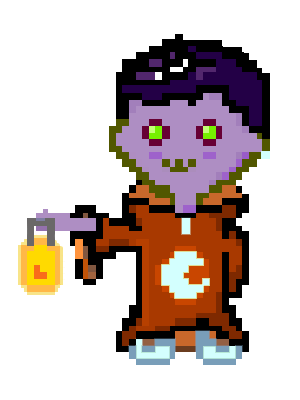

<div>
<h1> Hi there, I'm Eric &nbsp </h1></div>

<br>👨‍💻 I’m currently learning Web and GameDev (Unity, React, Javascript, CSS, Typescript, HTML, Javascript, C#)
<br>📫 How to reach me: ericmarinhoda@gmail.com
<br>
<br>
<p>
  <a href="https://www.linkedin.com/in/eric-marinho/"></a>
  <a href="https://www.instagram.com/ilidammadz/"></a>
</p>
<br>

```javascript
const eric = {
  pronouns: "he" | "him",
  code: [C#, Typescript, Javascript, HTML, CSS, Python, C, C++, Java, R],
  tools: [Unity, React, Node, Express, Prisma, Bootstrap, Photshop, Miro],
  services: [Firebase, Netlify, Vercel, LootLocker],
  challenge: "Create a new game demo every week"
}
```
 
<hr>
<div align='center'>
  
  &nbsp 
<div/>
<br>
<div align='center'>
  <a href="https://ilidam.itch.io"></a>
</div>
<div align='center'>
  <a href="https://gamejolt.com/@Ilidam"></a>
</div>
<hr color="black">

<p align='center'>
  
</p>
<br>
<p align='center'>
  
</p>
